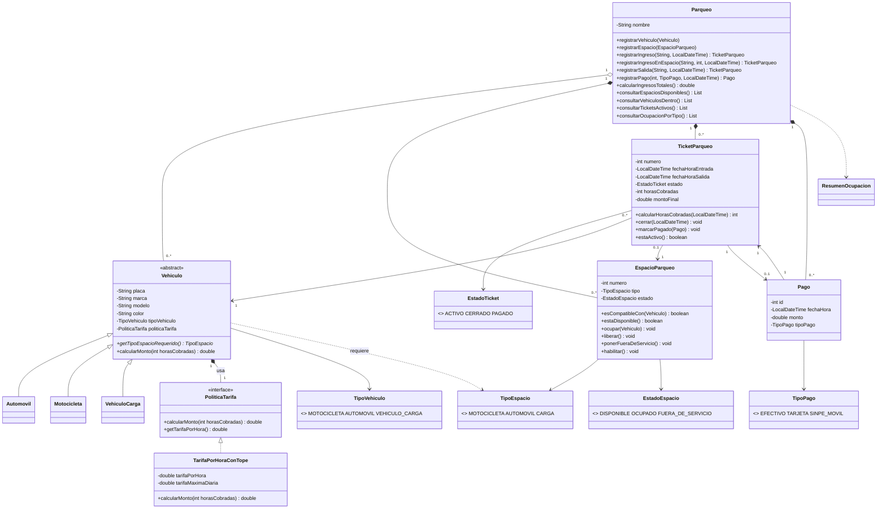

# Borrador del diagrama UML (para pasar a EasyUML)

Este diagrama es solo una referencia en texto. El entregable final debe hacerse en EasyUML
(o la herramienta que indique el profesor) mostrando: clases, atributos, métodos principales,
herencia, interfaces, asociaciones, composición/agregación, multiplicidades y enumeraciones.

Para verlo renderizado: pegar el bloque en https://mermaid.live

